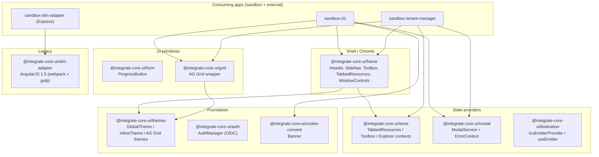

# Architecture

## Repository shape

pnpm-workspace monorepo with three top-level workspace roots (`pnpm-workspace.yaml:1`):

```
Frontend.Foundations.IntegrateCoreUI/
├── packages/         # @integrate-core-ui/* shared libraries (published)
│   ├── auth/            # OIDC authentication (Electron)
│   ├── cookie-consent/  # Framework-free banner (UMD + ESM)
│   ├── federation/      # MFE pub/sub context
│   ├── form/            # ProgressButton (Carbon + styled-components)
│   ├── frame/           # Outer shell (Header, SideNav, Toolbox, …)
│   ├── grid/            # AG Grid Enterprise wrapper
│   ├── idm-adapter/     # Legacy AngularJS 1.5 SPA (excluded from workspace)
│   ├── modal/           # ComposedModal + NiceModal integration
│   ├── store/           # React-context tab stores
│   └── themes/          # Milliman Carbon themes + AG Grid themes
├── apps/web/         # Sandbox demo applications
│   ├── sandbox-01/              # Frame + theme-builder showcase
│   ├── sandbox-idm-adapter/     # Express host for legacy AngularJS bundle
│   └── sandbox-tenant-manager/  # IDM admin SPA (Redux + TanStack + MSW)
├── tools/
│   └── storybook-host/  # Aggregates stories from all packages
├── docs/
│   ├── decisions/    # ADRs (dated filenames)
│   └── spikes/       # Technical spikes
├── pipelines/
│   ├── validate.yml  # PR/CI validation
│   └── deploy.yml    # Publish + static deploy
├── .verdaccio/       # Local npm registry for publish testing
├── .agents/          # Agent skill for playwright-cli
├── .github/          # Dependabot only
├── .husky/           # pre-commit → lint-staged
└── .vscode/          # Extensions + workspace
```

## Layered component view



## Entry points

### Packages (`packages/<name>/src/index.ts`)

- `packages/auth/src/index.ts:1` — `AuthManager`, `ErrorType`, `VERSION`, `DefaultAuthMessages`, `saveReturnUrl`, `getReturnUrl`, re-exported `User`.
  - `packages/auth/src/AuthManager.ts:1` — OIDC singleton (≈536 lines; `ErrorType` enum at `:30`, `VERSION` at `:18`).
  - `packages/auth/src/TokenRenewalManager.ts` — periodic silent renewal via `setInterval`.
  - `packages/auth/src/SilentAuth.ts` — iframe-callback entry, built as UMD `silentAuth.js` via `vite.silent-auth.config.ts`.
- `packages/cookie-consent/src/index.ts:1` → `cookie-consent.ts`.
  - `packages/cookie-consent/src/cookie-consent.ts:1` — exports `initCookieConsent()`. UMD bundle auto-initializes on `DOMContentLoaded` (`vite.config.mts:54`).
- `packages/federation/src/index.ts:1` — re-exports types + `createEmitter`, `IcuEmitterProvider`, `useEmitter`.
  - `packages/federation/src/create-emitter.ts:62` — emitter factory backed by `tseep`.
  - `packages/federation/src/emitter-context.tsx:18` — `IcuEmitterProvider`; `useEmitter` (`:27`, throws if missing).
- `packages/form/src/index.ts:1` → `progress-button`.
  - `packages/form/src/progress-button/progress-button.tsx:15` — `ProgressButton`.
- `packages/frame/src/index.ts:1-13` — 13 sub-barrel re-exports (`header`, `side-nav`, `toolbox`, `toggle-toolbox`, `tabbed-resources`, `help-menu`, `theme-toggle`, `window-controls`, `sign-out`, `content-region`, `click-boundry`, `dynamic-icon`, `version-copyright`).
- `packages/grid/src/index.ts:1` — exports `ag-grid` barrel + `ICellRendererParams`.
  - `packages/grid/src/ag-grid/ag-grid.tsx:99` — memoized `forwardRef` `AgGrid` component. License key embedded at `:22`.
  - `packages/grid/src/use-ag-grid-context/use-ag-grid-context.tsx` — `AgGridApisContext`, `useAgGridContext`.
- `packages/modal/src/index.ts:1-2` — `modal-service`, `modal`.
  - `packages/modal/src/modal-service.tsx:21` — `ModalService` extends NiceModal; custom `create` (`:30`) and `useModal` (`:52`). `ErrorContext` at `:23`.
  - `packages/modal/src/modal.tsx:12` — `Modal` (forwardRef Carbon ComposedModal).
- `packages/store/src/index.ts:1` — `contexts`, `providers`.
  - `packages/store/src/providers/context-provider.tsx:5` — `IntegrateCoreUiContext` = `<TabbedResourcesProvider><ToolboxProvider><ExplorerProvider>`. Alias `IcuContextProvider`.
  - `packages/store/src/contexts/createTabContext.tsx:49` — factory producing `{Provider, useTabStore}` for tab-based CRUD on `TabItem[]`.
  - `packages/store/src/contexts/tabbed-resources.context.tsx` — `TabbedResourcesProvider`, `useTabbedResources`, `ResourceContext`, `useResource`.
  - `packages/store/src/contexts/toolbox.context.tsx` — `ToolboxProvider`, `useToolbox`, `ToolContext`, `useTool`.
  - `packages/store/src/contexts/explorer.context.tsx:3` — `ExplorerProvider`, `useExplorer`.
- `packages/themes/src/index.ts:1-2` — `milliman`, `types`.
  - `packages/themes/src/milliman/global-theme.provider.tsx:25` — `GlobalThemeProvider` (alias `IcuGlobalThemeProvider`), `useGlobalTheme`.
  - `packages/themes/src/milliman/inline-theme.provider.tsx:19` — `InlineThemeProvider`, `MillimanThemes` enum (`:5`).
  - `packages/themes/src/milliman/ag-grid.ts:87` — `AgGridThemeContext`, `useAgGridTheme`, `themeQuartz.withParams(...)` themes wired to Carbon CSS variables.

### Sandbox apps

- `apps/web/sandbox-01/src/main.tsx:50` — root, wraps `<RootApp/>` in `ModalService.Provider` → `IntegrateCoreUiContext` → `GlobalThemeProvider`.
  - `apps/web/sandbox-01/src/app.tsx:202` — `App` shell (Header, SideNav, TabbedResources, Toolbox, Projects, ThemeBuilderPanel).
  - `apps/web/sandbox-01/src/theme-builder/` — token search, editor, preview, export.
- `apps/web/sandbox-tenant-manager/src/main.tsx:21` — root, wraps `RouterProvider` in Redux `Provider` → `ModalService.Provider` → `IntegrateCoreUiContext` → `GlobalThemeProvider`.
  - `apps/web/sandbox-tenant-manager/src/routes/__root.tsx:8` — layout shell.
  - `apps/web/sandbox-tenant-manager/src/routes/index.tsx:3` — redirects `/` → `/groups`.
  - `apps/web/sandbox-tenant-manager/src/store/tenant.api.ts:12` — RTK Query `createApi` (`reducerPath: 'gateway'`, tags `Groups|Users|TenantDetail|TenantEnvironmentDetail`).
  - `apps/web/sandbox-tenant-manager/src/store/slices/base-url/base-url.slice.ts:22` — `setAuthToken`; `dynamicBaseQuery` (`:36-55`) injects `Authorization: Bearer` on each request.
- `apps/web/sandbox-idm-adapter/server.js:1` — Express server, port 3001, serves `dist/packages/idm-adapter`, stubs `/api/idmapplication/configuration`, `/api/project/:projectId/edit/...`, etc.

### Tooling

- `tools/storybook-host/.storybook/main.ts:8` — aggregates stories via glob `../../../packages/**/*.stories.@(js|jsx|ts|tsx|mdx)`.
- `tools/publish-feed.ts:10` — `npm publish <distPath> --no-git-checks`, swallowing "version already exists" errors (regex match at `:34-48`).
- `.verdaccio/start.js:1` — spawns Verdaccio, waits for `http://localhost:4873/`, opens browser.

## Data flow

### Runtime (sandbox-tenant-manager canonical example)

1. `main.tsx:21` bootstraps Redux store + TanStack Router with hash history, inside Modal/ICU-context/Theme providers.
2. `<RouterProvider>` renders file-based routes; `__root.tsx:8` renders `frame`'s shell and a `<WorkerProvider>` (MSW worker start in dev/mock).
3. Route components (e.g., `pages/groups/groups.page.tsx:56`) call RTK Query hooks.
4. `tenant.api.ts:12` delegates to `dynamicBaseQuery` (`base-url.slice.ts:36`) which resolves the base URL from the `baseUrlSlice` by key (`GATEWAY`, `IDM`, `PROJECT_MANAGER`, …), attaches the auth token, and issues `fetch`.
5. In tests/storybook, MSW intercepts the request and returns handler-provided fixtures (`src/store/test/handlers.ts:14`, fixtures under `src/store/fixtures/`).
6. State side-effects: `tenant.slice.ts:19-33` auto-seeds `activeTenant / activeEnvironment / activeGroup / activeRole` from the first API response.

### Tabbed-resources / toolbox (frame ↔ store)

- Apps create tabs via `useTabbedResources().addResource(...)` and tools via `useToolbox().addTool(...)`. Both are produced by the shared factory `createTabContext(contextId)` in `packages/store/src/contexts/createTabContext.tsx:49`.
- `frame` components (`tabbed-resources`, `toolbox`, `toggle-toolbox`) read from these contexts and render Carbon UI.
- `sandbox-01/src/app.tsx:266-322` — canonical example of side-nav items pushing resources into the tab store.

### Auth (Electron, AuthManager)

1. `AuthManager` is a singleton instantiated in a hidden Electron renderer (decided in ADR 2025-03-01). Token lives in that window's `localStorage`, isolated from the main renderer.
2. Implicit Flow via `oidc-client` with a `SilentAuth` iframe for renewal (`packages/auth/src/SilentAuth.ts`).
3. `TokenRenewalManager` periodically triggers silent renewal.
4. `utils/returnUrl.ts` persists the URL the user was trying to reach across the redirect.
5. `AuthLogger` prefixes all logs with `[Auth Manager]`.

## Module Federation (planned)

- The repo currently has **no active MF runtime** — the `federation` package ships only types + a pub/sub context. The sandbox apps are independent SPAs.
- Direction is captured in `docs/decisions/[2026-02-16]-MFE-Architecture-Design.md`: coarse-grained domain MFEs, **Rspack** for Module Federation (Vite's MF support is unreliable — see companion ADR), platform-configured route-based composition, pub/sub over props.
- Operations model is captured in `docs/decisions/[2026-02-16]-MFE-Development-Operations.md`: static hosting to Azure Blob `ltssharedassets/$web/OneIntegrate/remotes/<name>/`, an Integration Gate ADO template run per remote, additive versioning for breaking changes.

## Package dependency graph (intra-workspace)

- `frame` → `store`, `themes` (peer-declared `workspace:*`).
- `grid` → `themes` (peer).
- `store` → `themes` (peer); declares `react-redux` / `@reduxjs/toolkit` peer deps but source does not yet use them.
- All others have no intra-workspace peers beyond externals.

## Publish & deploy flow

```
[PR / main push]
   └─► pipelines/validate.yml
         ├─ FE_Validate  (build + lint + typecheck + test, ubuntu)
         ├─ E2E_Validate (Playwright on sandbox-tenant-manager, windows)
         └─ IdmAdapter_Validate (separate npm build, ubuntu)

[validate success on main]
   └─► pipelines/deploy.yml (pipeline-resource trigger)
         ├─ Publish_IntegrateCoreUiNext → ADO feed `rainier-latest`
         │     └─ idm-adapter via tools/publish-feed.ts (idempotent)
         ├─ Deploy_Static_Webpages      → ltssharedassets/$web
         │     ├─ Storybook host → /IntegrateCoreUiNext/storybook
         │     └─ sandbox-01    → /IntegrateCoreUiNext/web/sandbox-01
         └─ Deploy_CookieConsent        → legalassets/$web
```

## Notable architectural choices

- **Carbon Design System everywhere** — shared chrome and all primitives sit on top of `@carbon/react`. Theming goes through `@carbon/themes` and `@carbon/styles` with Milliman overrides in `themes/src/milliman/themes.scss`.
- **No Redux in the shared libraries** (except as a declared peer in `store`) — React Context is the intra-package state model. Redux is only used inside `sandbox-tenant-manager`.
- **No Next.js / SSR** — explicitly rejected (`docs/decisions/[2025-04-30]-Avoiding-Nextjs-For-Monorepo-Web-App.md`) due to Carbon + SSR hydration friction.
- **idm-adapter is deliberately excluded from the workspace** — its legacy Angular 1.5 + Gulp + Webpack 1 toolchain is frozen; workspace tools (pnpm, eslint) skip it.
- **Storybook host is stories-only** — no addons (`tools/storybook-host/.storybook/main.ts:9` — empty array); `interactions` and `actions` features disabled.
- **Ghost package `formatter`** — referenced in root `package.json:6` build script and in `tsconfig.base.json:21` path aliases, but the directory does not exist on disk. Expected to be reintroduced or cleaned up.
- **License key for AG Grid Enterprise** is checked into source at `packages/grid/src/ag-grid/ag-grid.tsx:22`.
