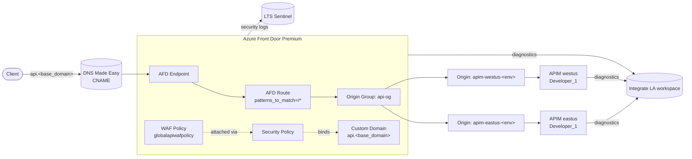

# Architecture

## Component overview

The stack is a single Terraform root (`ingress/deploy/`) that fans out a child module (`modules/regional_apim/`) once per entry in `var.apim_regions`. All regional APIMs share one Front Door profile, one origin group, and one route, so adding a region only adds an APIM + an origin.

## Entry points

- **Root Makefile** — `Makefile:17` exposes `ingress__%` which delegates to the ingress component.
- **Ingress dispatcher** — `ingress/make.mk:14` exposes `infra__%` which delegates into the deploy directory.
- **Terraform root** — `ingress/deploy/` (every `*.tf` file is part of the root module). Provider / backend: `ingress/deploy/provider.tf:1`. Variables: `ingress/deploy/variables.tf:1`.
- **Regional APIM module** — `ingress/deploy/modules/regional_apim/` instantiated at `ingress/deploy/regional_apim.tf:1`.
- **ADO pipeline** — `ingress/.pipelines/iac-deploy.yaml:59` defines the `tf_validate` / `dev_package` stages.
- **Developer login** — `auth.sh:1`.

## Data flow at runtime (request path)

1. A client resolves `api.<base_domain_name>` (e.g., `api.plt.integrate-solutions.com`). DNS Made Easy answers with a CNAME to the AFD endpoint hostname (`ingress/deploy/dns.tf:5`).
2. Azure Front Door terminates TLS with the customer certificate stored in Key Vault and referenced via `azurerm_cdn_frontdoor_secret.domain` (`ingress/deploy/afd_domain.tf:12`).
3. The security policy binds the WAF policy `globalapiwafpolicy` to the custom domain for all paths (`ingress/deploy/afd_domain.tf:23`). Default Rule Set 2.1 and the Bot Manager rule set run in **Log** (detection) mode; `TRACE` and sanctioned-geo source IPs are **blocked** outright (`ingress/deploy/afd_waf.tf:23`, `:37`).
4. The AFD route (`ingress/deploy/afd_route.tf:1`) matches `/*`, forces HTTPS redirect, and forwards to the `api-og` origin group. Origin IDs are collected from every regional APIM module via `flatten(... module.regional_apim ... .afd_origin_ids)`.
5. Front Door picks a regional APIM origin (load-balancing `sample_size=4`, `successful_samples_required=3`) and forwards to `apim-<region>-<env>.azure-api.net` using the hostname extracted from `azurerm_api_management.apim_internal.gateway_regional_url` (`ingress/deploy/modules/regional_apim/afd_origin.tf:3`).
6. APIM (Developer SKU, public network access on) handles the request. `virtual_network_type = "None"` today; commented code hints at future `Internal` VNet integration (`ingress/deploy/modules/regional_apim/apim.tf:18`).
7. AFD access/WAF logs flow to both the Integrate Log Analytics workspace and the LTS Sentinel workspace (`ingress/deploy/afd_diagnostics.tf`). APIM diagnostics flow to the Integrate workspace only (`ingress/deploy/modules/regional_apim/diagnostics.tf:5`).

## Data flow at deploy time

1. Developer or ADO pipeline invokes `make ingress__infra__<target>`.
2. `ingress/make.mk:14` re-enters `make` inside `ingress/deploy/` with `-f make.mk`.
3. `ingress/deploy/make.mk` imports `../../cicd-shared/make/terraform.mk` from the submodule, sets `STACK_NAME=ingress`, computes the backend key, and loads tfvars from `../configuration/${ENVIRONMENT}.json`.
4. Unless `SKIP_DME_SECRETS=true`, DME creds are resolved from Key Vault `connsec-<env>` (dev moniker used for `plt`) and exported (`ingress/deploy/make.mk:17`).
5. Terraform runs inside the `terraform` compose service; state lives in Azure Storage per backend HCL; plan/apply artifacts are published by the ADO package template.
6. Checkov scans the plan and publishes a JUnit report (`shared/azdo-templates/package-iac-template.yaml:40`).

## Module / package layout

| Path | Role |
| --- | --- |
| `Makefile` | Root make dispatcher; includes `cicd-shared/make/help.mk` and optional `env-local.mk`. |
| `cicd-shared/` | Git submodule (`milliman-lts/cicd-shared`) supplying reusable make targets (`help.mk`, `terraform.mk`, etc.). |
| `shared/azdo-templates/` | ADO pipeline step templates shared across components. |
| `ingress/make.mk` | Component-level dispatcher that forwards `infra__*` into `ingress/deploy/`. |
| `ingress/configuration/` | Per-env Terraform variable files and backend configs. `plt.json` targets prod-ish platform, `dev.json` targets dev. |
| `ingress/deploy/` | Terraform root module. Each `*.tf` file owns one concern (AFD, WAF, route, domain, DNS, diagnostics, resource group, tags, context, providers, variables). |
| `ingress/deploy/modules/regional_apim/` | Child module: one APIM + one AFD origin + diagnostics per region. |
| `ingress/deploy/tests/checks.rego` | Placeholder Conftest/OPA policy package (empty rules today). |
| `ingress/.pipelines/iac-deploy.yaml` | ADO pipeline definition. |
| `docker-compose.yaml` | Container definitions for terraform, tflint, terraform-docs, Checkov, Conftest, terraform-change-annotate, plus generic `bash`/`python`/`black`/`utils` helpers. |

## Naming conventions

- `local.resource_identifier = "<resource_identifier>-<environment>"` with dots collapsed to dashes (`ingress/deploy/context.tf:2`). For example, `integrate-gtm-dev`.
- APIM names: `apim-<region>-<environment>` (`ingress/deploy/modules/regional_apim/context.tf:2`).
- Custom domain: `api.<base_domain_name>` (`ingress/deploy/context.tf:3`).
- AFD secret name mirrors the base domain with dots collapsed; WAF policy is hard-coded to `globalapiwafpolicy` (`ingress/deploy/context.tf:5`).

## Tagging strategy

`ingress/deploy/tags.tf:1` applies a consistent tag block to every taggable resource:

- `system-name = api.foundations`
- `system-owner = Platform Engineering`
- `system-domain = Platform`
- `system-component-name = ingress`
- `environment-name = <env>`
- `environment-client-operational-classification` = `production` when env is `prod`, else the env name
- `environment-data-classification = Confidential - Internal Only`
- `environment-cost-centre = Engineering`
