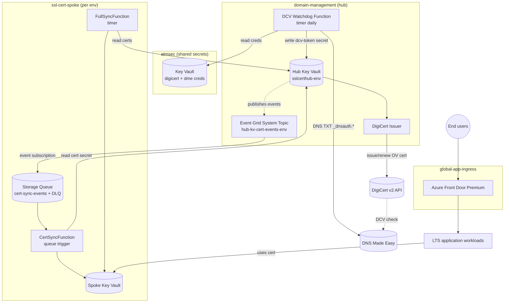

# app.foundations.trafficmanagement — Architecture

## Component overview (prose)

The repo is organized as **four independent Terraform stacks** (`atmsec`, `domain-management`, `ssl-cert-spoke`, `global-app-ingress`) plus **two shared modules** (`shared/modules/KeyVault`, `shared/modules/flex-function-app`). Each stack is deployable on its own and has its own Azure DevOps pipelines.

The central design is a **hub-and-spoke certificate distribution topology**:

- **`atmsec` (shared secrets)** is a standalone stack that owns a Key Vault holding DigiCert and DNS Made Easy API credentials. Every other stack that needs to talk to DigiCert or DME reads from this vault via RBAC.
- **`domain-management` (the hub)** is the brain. It provisions the **hub Key Vault** (`sslcerthub-<env>`), registers DigiCert as an issuer, declares each domain as an Azure Key Vault `certificate` with auto-renewal, and owns the **DCV Watchdog** Azure Function that closes the DCV loop by writing TXT records into DNS Made Easy. When a cert is issued or is nearing expiry, the hub KV emits events to a shared **Event Grid System Topic** (`hub-kv-cert-events-<env>`).
- **`ssl-cert-spoke` (the spokes)** are lightweight stacks. Each spoke provisions its own Key Vault, a storage account with a `cert-sync-events` queue (+ DLQ), and two functions: `CertSyncFunction` (queue-triggered per event) and `FullSyncFunction` (timer-triggered safety net). The spoke **subscribes to the hub Event Grid topic** — hub cert events land in the spoke's queue and trigger a copy of the cert from hub KV to spoke KV.
- **`global-app-ingress` (GAI)** stands up Azure Front Door Premium as the shared edge in front of LTS apps. Minimal stack today (marked "Incubating, TODO add IaC build badge").

### High-level mermaid

## Stacks (entry points)

### `atmsec/` — shared API-credential secrets

- **Status:** Generally Available.
- **Root modules:** `atmsec/deploy/main.tf`, `secrets.tf`, `variables.tf`.
- **What it creates:**
  - An `azurerm_resource_group` per env.
  - A Key Vault (via `shared/modules/KeyVault`) holding:
    - `digicert-org-id`, `digicert-api-key`, `digicert-account-id`
    - `dme-api-key`, `dme-secret-key`
  - Secrets are created with value `"changeme"` and `lifecycle { ignore_changes = [value] }` so Terraform does not fight the out-of-band secret rotation.
- **RBAC:** grants **Key Vault Secrets User** to named AAD groups and to the workload identities of the DCV Watchdog and GAI stacks (`atmsec/deploy/modules/secrets/secrets.tf`).
- **Configuration:** `atmsec/configuration/dev.json`.
- **Pipeline:** `atmsec/.pipelines/infra-cd.yaml`.

### `domain-management/` — the hub

- **Status:** Incubating.
- **Root modules:** `domain-management/deploy/*.tf`:
  - `rg.tf` — resource group.
  - `keyvault.tf` — hub KV via shared module.
  - `domain.tf` + `deploy/modules/domain/` — per-domain submodule (DigiCert registration, DME domain, KV cert resource).
  - `certificates.tf` — `azurerm_key_vault_certificate_issuer` (DigiCert) + per-domain `azurerm_key_vault_certificate` with OV + auto-renewal.
  - `eventgrid.tf` — `azurerm_eventgrid_system_topic` on the hub KV (`Microsoft.KeyVault.vaults`).
  - `dcv_watchdog_func.tf` — provisions the DCV Watchdog via `shared/modules/flex-function-app`.
  - `secret_grants.tf` — RBAC to `atmsec` KV for function MI.
  - `spoke_permissions.tf` — grants spoke workload identities **Key Vault Secrets User** on the hub so `CertSyncFunction` can read hub cert secrets.
  - `observability.tf` — diagnostic settings + metric alerts.
- **DCV Watchdog Function:** `domain-management/functions/dcv-watchdog/src/`.
  - Entry: `DcvWatchdogFunction/main.py` → `handler.py:DcvWatchdogHandler.execute()`.
  - State machine: `domain_state.py` — `DomainState` × `DomainAction` lookup drives one action per domain per run.
  - Action handlers: `actions/{add_domain,activate_domain,submit_validation,cleanup_dcv_records}.py` (function-factory dispatch).
  - Clients: `clients/{digicert_client_v2,dme_client,keyvault_client}.py`.
  - Instrumentation: `instrumentation/__init__.py` with `@traced` OTEL decorator.
  - Tests: comprehensive pytest suite under `tests/`.
- **Configuration:** `configuration/dev.json`, `configuration/prod.json`.
- **Pipelines:** `.pipelines/infra-cd.yaml`, `.pipelines/function-cd.yaml`.
- **Runbook:** `docs/runbooks/adding-spoke-for-cert-distribution.md`.

### `ssl-cert-spoke/` — per-env spokes

- **Status:** Incubating.
- **Environments shipped:** `apidev`, `dev`, `gitopsdev`, `gitopsprod` (configs under `ssl-cert-spoke/configuration/`).
- **Root modules:** `ssl-cert-spoke/deploy/*.tf`:
  - `main.tf`, `rg.tf`, `provider.tf`, `context.tf`, `tags.tf`, `outputs.tf`.
  - `certificates.tf` — placeholder KV certs on the spoke (to be overwritten by sync).
  - `queue.tf` — storage account, `cert-sync-events` queue, DLQ container.
  - `eventgrid.tf` — `azurerm_eventgrid_system_topic_event_subscription` against the **hub** topic, delivered to the spoke queue, filtered on event types `Microsoft.KeyVault.CertificateNewVersionCreated` and `Microsoft.KeyVault.CertificateNearExpiry`.
  - `hub_keyvault.tf` — data source to the hub KV.
  - `cert_sync_func.tf` — two functions (CertSync + FullSync) via `shared/modules/flex-function-app`.
  - `permissions.tf` — MI role assignments on hub KV (read), spoke KV (write), storage queue (process).
  - `observability.tf`.
- **CertSync Function:** `ssl-cert-spoke/functions/cert-sync/src/`.
  - `CertSyncFunction/main.py` — queue trigger on `cert-sync-events`. Parses event subject `certificates/<name>`, then delegates to `shared/sync_logic.py`.
  - `FullSyncFunction/main.py` — timer trigger `%FULL_SYNC_SCHEDULE%`. Enumerates all hub certs and syncs any newer than the spoke copy.
  - `shared/sync_logic.py` — compares `updated_on` timestamps; downloads hub cert secret (base64 PKCS12, empty password); imports into spoke KV.
  - `shared/config.py`, `shared/keyvault_client.py`.
- **Pipelines:** `.pipelines/infra-cd.yaml`, `.pipelines/function-cd.yaml`.

### `global-app-ingress/` — Azure Front Door Premium edge

- **Status:** Incubating (README: "TODO add IaC build badge").
- **Root modules:** `global-app-ingress/deploy/*.tf`:
  - `afd.tf` — `azurerm_cdn_frontdoor_profile` (`Premium_AzureFrontDoor`).
  - `afd_diagnostics.tf` — diagnostic settings.
  - `rg.tf`, `variables.tf`, `tags.tf`, `provider.tf`, `outputs.tf`.
- **Identity:** user-assigned managed identity (read access to `atmsec` for cert-related creds; exact wiring light today).
- **Make prefix:** `gai__`.
- **Pipeline:** `.pipelines/infra-deploy.yaml`.

## Shared modules

### `shared/modules/KeyVault/`

- Creates `azurerm_key_vault` with:
  - RBAC authorization (`enable_rbac_authorization = true`).
  - Purge protection.
  - Network ACLs (allow Azure services, deny public by default).
  - **Diagnostic settings** to both a Sentinel workspace and a regional Log Analytics workspace (`diagnostics.tf`).
  - Accepts `role_assignments` map to grant identities Secrets User / Certificates Officer / Secrets Officer as needed (`role_assignments.tf`).
- Used by `atmsec`, `domain-management` (hub), and `ssl-cert-spoke` (spoke).

### `shared/modules/flex-function-app/`

- Creates:
  - Storage account for the function.
  - `azurerm_service_plan` (Flex Consumption, SKU `FC1`, Linux).
  - `azurerm_linux_function_app` with:
    - SystemAssigned identity.
    - `WEBSITE_RUN_FROM_PACKAGE` pointing at a blob URL (deploy uploads the zip and the function restarts).
    - CORS allowing `https://portal.azure.com`.
    - **IP restriction to AzureCloud service tag**.
    - Application settings fed from caller-supplied map.
  - Metric alerts (`metric_alerts.tf`) for failures, HTTP 5xx, memory.
  - Storage RBAC auto-granted to the function MI (`function_app_keys.tf`).
- Used by the DCV Watchdog and both CertSync functions.

## Per-env configuration

Each stack reads a `configuration/<env>.json`:

- `atmsec/configuration/dev.json`
- `domain-management/configuration/{dev,prod}.json`
- `ssl-cert-spoke/configuration/{apidev,dev,gitopsdev,gitopsprod}.json`
- `global-app-ingress/configuration/dev.json`

The root `Makefile` loads the matching JSON (by `ENV=` var) and feeds it into `terraform` via `-var-file`.

## Request / event flow — a renewal

1. Hub KV sees a cert approaching expiry (near-expiry threshold).
2. DigiCert issuer re-issues (OV, DNS-TXT DCV).
3. DigiCert asks for a TXT record at `_dnsauth.<domain>`.
4. **DCV Watchdog** (daily timer) picks up the pending validation — state `EXISTS_ACTIVE_PENDING_VALIDATION` → action `SUBMIT_FOR_VALIDATION`, writes TXT via DME, stores `<domain>-dcv-token` + `<domain>-dcv-requested-at` secrets in the hub KV.
5. DigiCert validates, new cert version lands in hub KV.
6. KV emits `Microsoft.KeyVault.CertificateNewVersionCreated` → Event Grid system topic → spoke queues.
7. Each **CertSyncFunction** picks up its event → downloads new PKCS12 → imports into its spoke KV.
8. **FullSyncFunction** (timer) reconciles any missed events.
9. After `CLEANUP_TXT_PERIOD_HOURS`, Watchdog runs the `CLEANUP_DCV_RECORDS` action to remove stale DCV TXTs.

## Security posture

- **No long-lived secrets in Terraform state** — pipelines use Azure DevOps **OIDC federated identity** (`ARM_USE_OIDC=true`).
- **RBAC everywhere** — Key Vaults use RBAC authorization; access is granted by the module caller as role assignments, never by access policies.
- **Workload identity** — all functions use SystemAssigned identity.
- **Secrets rotation out-of-band** — `atmsec` secrets are `ignore_changes = [value]`; rotation happens via the portal or a rotation runbook.
- **Mandatory tagging** — every resource bears the eight platform tags from per-stack `tags.tf`; tags are asserted by Conftest.
- **Diagnostic logs** to Sentinel + Log Analytics on all Key Vaults.
- **Network:** KVs deny public by default (allow AzureServices); function apps IP-restricted to AzureCloud service tag.

## Non-obvious constraints

- **Terraform `>= 1.14.5`** and docker images pinned to `1.14.5`. Older tf will not plan.
- **DCV Watchdog is `DRY_RUN=true` by default** — real side effects require explicit config flip.
- **Empty PKCS12 password** convention when downloading certs from KV — encoded as base64, imported with empty password on the spoke.
- **Timer-triggered FullSync schedule** is a string app-setting (`%FULL_SYNC_SCHEDULE%`), set per env.
- **`_dnsauth.<domain>` DCV TXT records** are the chosen DCV method — email DCV is deliberately not supported.
- **Event Grid System Topic is on the hub KV only** — spokes do not publish; they subscribe.
- **`cicd-shared` submodule must be initialized** for `make help` to work (`.gitmodules`).
