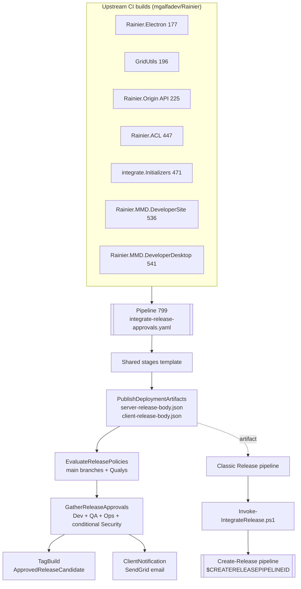

# Architecture

## Component overview



## Entry points

- **`.pipelines/integrate-release-approvals.yaml:1`** — root ADO pipeline definition (pipeline 799). Defines `resources.pipelines` for all upstream CI builds and all stages below.
- **`.pipelines/integrate-release-approvals-sandbox.yaml:1`** — sandbox ADO pipeline definition that references the same resources but disables side-effecting release actions.
- **`.pipelines/templates/stages/integrate-release-approvals-stages.yaml:1`** — shared implementation template used by production and sandbox pipeline entry points.
- **`.pipelines/integrate-release-approvals.yaml`** — `EvaluateReleasePolicies` stage runs after release-body artifact publishing and before approvals.
- **`.pipelines/scripts/Assert-ResourceBranchesAreMain.ps1`** — checks all `RESOURCES_PIPELINE_*_SOURCEBRANCH` values are `refs/heads/main`.
- **`.pipelines/scripts/Assert-QualysScanPassed.ps1`** — locates the Qualys scan run for the Developer Site resource and gates Security approval based on the result.
- **`.pipelines/integrate-release-approvals.yaml:189`** — `TagBuild` stage; writes the `ApprovedReleaseCandidate` build tag (line 199).
- **`.pipelines/integrate-release-approvals.yaml:202`** — `ClientNotification` stage; invokes the Bash notification script (line 212).
- **`.pipelines/scripts/Invoke-IntegrateRelease.ps1:57`** — PowerShell `param(...)` block is the CLI entry; `$PSCmdlet.ShouldProcess(...)` at line 129 triggers the downstream release.
- **`.pipelines/scripts/ClientNotification/send-release-notification-email.sh:1`** — Bash entry point; positional args defined at lines 3–5.

## Data flow

1. **Upstream triggers.** Any tagged `IndividualCI` build of Electron, DeveloperSite, or DeveloperDesktop — or any main-branch build of GridUtils, Origin, ACL, or Initializers — triggers pipeline 799 (`integrate-release-approvals.yaml:9–51`).
2. **Manual candidate selection.** Authoring and Governance accepts or rejects the candidate in `SelectReleaseCandidate` (timeout 30 days, `onTimeout: reject`).
3. **Artifact synthesis.** `PublishDeploymentArtifacts` writes two JSON documents containing the resolved upstream `runName` values under `resources.pipelines.*.version`:
   - `server-release-body.json` — origin, acl, initializers, developersite, developerdesktop.
   - `client-release-body.json` — electron.
   Both are published as ADO build artifacts (`PublishBuildArtifacts@1`) with matching container names.
4. **Policy enforcement.** `EvaluateReleasePolicies` fails if any pipeline resource did not originate from `refs/heads/main`; it also checks Qualys scan status for the Developer Site run and requires Security approval if the scan is absent or unsuccessful.
5. **Manual approvals.** Dev, QA, and Ops approvals run after policy checks; Security approval is conditional on the Qualys policy result. In sandbox mode, these are replaced by a no-op dummy approval job.
6. **Tagging.** `TagBuild` emits `##vso[build.addbuildtag]$(buildTag)` so production applies `ApprovedReleaseCandidate` and sandbox applies `SandboxApprovedReleaseCandidate`.
7. **Customer notification.** `ClientNotification` downloads sources and runs `send-release-notification-email.sh`, which:
   - Parses `email-notification-config.json` (from) and `recipients/release-approvals.json` (to/bcc) via `python3 -c`.
   - Constructs a SendGrid `personalizations` JSON payload (`send-release-notification-email.sh:48–59`).
    - POSTs to `https://api.sendgrid.com/v3/mail/send` with the `$(send_grid_api_key)` bearer token unless `DRY_RUN=true`.
   - Non-2xx responses exit 1, but the pipeline sets `continueOnError: true` at `integrate-release-approvals.yaml:214`.
8. **Downstream release dispatch.** A separate Classic Release consumes the approved build, downloads the release-body artifact under the `_Integrate App Approvals` alias, and runs `Invoke-IntegrateRelease.ps1`:
   - Reads the JSON at `$SYSTEM_ARTIFACTSDIRECTORY/_Integrate App Approvals/<type>-release-body/<type>-release-body.json` (`Invoke-IntegrateRelease.ps1:78–82`).
   - Adds `resources.repositories.self.refName = $PIPELINERUNBRANCH` (line 108).
   - Adds `templateParameters` (product, releaseName, releaseId, releaseEnvironmentId) (line 114).
   - Serializes with `ConvertTo-Json -Depth 10` and delegates to `Run-Pipeline.ps1` from the `integrate.Environments` repo (line 130).

## Module / package layout

```
.
├── README.md                                           -- repo landing page
├── CODEOWNERS                                          -- review routing
└── .pipelines/
    ├── .gitkeep
    ├── integrate-release-approvals.yaml                -- ADO pipeline 799
    ├── integrate-release-approvals-sandbox.yaml        -- sandbox entry point
    ├── templates/stages/integrate-release-approvals-stages.yaml
    └── scripts/
        ├── Invoke-IntegrateRelease.ps1                 -- Classic Release dispatcher
        ├── Assert-ResourceBranchesAreMain.ps1          -- release policy branch provenance check
        ├── Assert-QualysScanPassed.ps1                 -- Qualys scan polling check
        ├── Test-QualysScanPassed.ps1                   -- local/dev helper for Qualys polling script
        └── ClientNotification/
            ├── README.md                               -- usage docs for the notifier
            ├── send-release-notification-email.sh      -- SendGrid caller
            ├── email-notification-config.json          -- global "from" address
            └── recipients/
                └── release-approvals.json              -- to/bcc for pipeline 799
```

## Cross-references to external repos

- **`integrate.Environments`** — hosts `Run-Pipeline.ps1` (default path `./integrate.Environments/.pipelines/release-process/scripts/Run-Pipeline.ps1`) and is expected to be checked out alongside this repo in the Classic Release. Referenced in `Invoke-IntegrateRelease.ps1:67`.
- **Engineering Foundations lifecycle docs** — linked from the README badge: `milliman-lts/engineering.foundations.github/docs/life-cycle-designations.md`.
