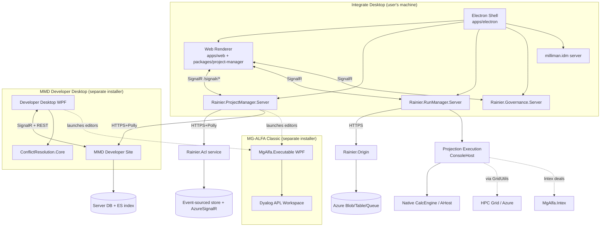

# rainier — Architecture

## Component overview (prose)

Rainier is a mono repo that produces **one customer-facing artifact** — the **Integrate desktop application** — plus several supporting products and libraries that feed into it.

At runtime the Integrate desktop is an Electron shell (`monorepo/desktop/ui/apps/electron/`) that manages multiple browser windows (gateway selection, auth, main app) and launches several co-located .NET server processes (`src/server/`) for project management, job execution, governance, and application hosting. These local services talk to cloud services — ACL (`src/Rainier.Acl/`), Origin (`src/Rainier.Origin/`), the MMD Developer Site (`monorepo/model-development/src/Server/`) — to synchronize projects, request storage credentials for cloud runs, and collaborate on shared models.

For the **MG-ALFA Classic** editor and the **MMD Developer Desktop**, the repo produces separate Windows installers. MG-ALFA Classic wraps a Dyalog APL workspace via a large C# transaction-layer (`monorepo/mg-alfa/NUI/NUI/Milliman.MGAlfa.AplInterface/`), surfacing WinForms and WPF editors for Database, Input, Table, Formula DB, and Inforce files. MMD Developer Desktop is a WPF client that syncs GDF-encoded model files with the Developer Site server and uses a three-way merge engine for conflict resolution.

**Projection Execution** (`monorepo/projection-execution/`) orchestrates the native calc engine (AHost) — either in-process, as a child process, on the HPC grid, or on Azure — to execute model projections. Run Manager (`src/server/Rainier.RunManager/`) is the user-facing controller; Projection Execution is the engine; GridUtils (external, wired via `monorepo/grid-utils-integration/*.targets`) is the grid substrate.

### High-level mermaid



## Entry points

### Integrate desktop app

- **Electron main:** `monorepo/desktop/ui/apps/electron/src/app.ts:1` — bootstraps dev flags/feature toggles, then `app.on('ready', ...)` → `startSingleInstance`.
- **Electron orchestrator:** `monorepo/desktop/ui/apps/electron/src/main/integrateApp.ts:34` — class `IntegrateApp`, state machine `INITIAL → GATEWAY_SELECTION → AUTH → MAIN → SHUTTING_DOWN` (transitions at `:57-110`).
- **Web renderer bootstrap:** `monorepo/desktop/ui/apps/web/src/index.tsx:1` → `apps/web/src/app.tsx:61`.
- **Skeleton loader:** `monorepo/desktop/ui/apps/skeleton/src/skeleton.tsx:7`.
- **Server launcher:** `monorepo/desktop/ui/apps/electron/src/servers/serverCollectionLauncher.ts` — starts `milliman.governance`, `milliman.idm`, `milliman.project-manager`, `milliman.run-manager`.

### Backend .NET services (each uses `ServiceHost<Program>`)

| Service | Program.cs | Startup.cs | Base URL |
|---|---|---|---|
| ACL (cloud) | `src/Rainier.Acl/src/Rainier.Acl/Program.cs:17` | `...Startup.cs:37` | cloud |
| Application Host (cloud) | `src/Rainier.Application.Host/src/Rainier.Application.Host/Program.cs:11` | `...Startup.cs:25` | cloud |
| Origin (cloud) | `src/Rainier.Origin/Origin/Program.cs:14` | `...Startup.cs:26` | cloud |
| ProjectManager (local desktop) | `src/server/Rainier.ProjectManager/Rainier.ProjectManager.Server/Program.cs:17` | `...Startup.cs:45` | `https://localhost:50202` |
| RunManager (local desktop) | `src/server/Rainier.RunManager/Rainier.RunManager.Server/Program.cs:13` | `...Startup.cs:39` | local |
| Governance (local desktop) | `src/server/Rainier.Governance/Rainier.Governance.Server/Program.cs:15` | `...Startup.cs:38` | local |

### MG-ALFA Classic

- **WPF main:** `monorepo/mg-alfa/NUI/NUX/Source/MgAlfa.Executable/App.xaml.cs:63`.
- **WinForms host window:** `monorepo/mg-alfa/NUI/NUI/Milliman.MGAlfa.UI/HostWindow.cs`.
- **Editors dispatcher:** `monorepo/mg-alfa/NUI/editors/src/Program.cs:15` → `App.cs` → `EditorRunner.cs` → {`ModelEditorLauncher`, `InputEditorLauncher`, `TableEditorLauncher`, `FormulaDatabaseLauncher`}.
- **CLI utilities:** `monorepo/mg-alfa/NUI/SupportApplications/{Ain2FileDumper,Atb2TextImport,FixedLivesConverter,GdfViewer,RegTestRunTime,DocumentVersionNumberUpdater,Cmd2DLPMemoryUtilizationSwitcher}/Program.cs`.

### MMD

- **Developer Desktop WPF:** `monorepo/model-development/src/DiffMergeClient/DeveloperDesktop/App.xaml.cs`; installer wiring in `DeveloperClientInstaller.cs`.
- **Developer Site server:** `monorepo/model-development/src/Server/WebSite/` + `Server/WorkerRole/` + `Server/WorkerRoleHost/`.
- **Conflict resolution:** `src/DiffMergeClient/ConflictResolution/ConflictResolution.Core/`.

### Projection Execution

- **Console host:** `monorepo/projection-execution/src/MgAlfa.ProjectionExecution/MgAlfa.ProjectionExecution.ConsoleHost/` → `Milliman.LTS.MgAlfa.ProjectionExecution.ConsoleHost.exe` (takes a `ProjectionExecutionConfiguration` JSON).
- **Regression suite:** `monorepo/projection-execution/src/MgAlfa.ProjectionExecution/MgAlfa.ProjectionExecution.RegressionTest/Program.cs`.

## Data flow (typical actions)

### "Open a project and sync from cloud"

1. User launches Integrate → Electron main (`integrateApp.ts`) authenticates via OIDC (`renderers/auth/`), gets JWT.
2. Electron main launches local .NET servers (`serverCollectionLauncher.ts`). JWT passed through.
3. User opens a project in the web renderer (`packages/project-manager/authoring.view/`).
4. `POST /api/projects/open` → `Rainier.ProjectManager.Server` (`Controllers/ProjectsController.cs:72`) dispatches `ImportProjectCommand` via MediatR.
5. ProjectManager calls MMD Developer Site (Polly-wrapped `HttpClient`) to fetch project metadata / branches.
6. ProjectManager publishes progress via SignalR `/signalr/projectmanager` (`GeneralHub`).

### "Run a projection"

1. User clicks Run → renderer hits `POST /api/jobs/run/{id}` (`Rainier.RunManager.Server/Controllers/JobsController.cs:99`).
2. RunManager dispatches `StartProjectionsCommand` — invokes Projection Execution (`ConsoleHost.exe`) with a `ProjectionExecutionConfiguration`.
3. Projection Execution delegates to `MgAlfa.Runs.Execution` which runs either:
   - **Local** AHost in-process,
   - **Grid** via `NestedProjection.JobManager.exe` + `AhostSolver.exe` (GridUtils targets),
   - **Cloud** — calls Origin (`src/Rainier.Origin/.../StorageController.cs:40`) to get SAS URIs for input/output/cancel queues, uploads inputs, posts to input queue, polls output.
4. RunManager streams progress to the renderer via SignalR `/signalr/runmanager` (`ProjectionExecutionStatusHub`).
5. Results downloaded via `GET /api/jobs/Download...` endpoints.

### "Sync + merge a branch (conflict resolution)"

1. Renderer calls `POST /api/projects/syncMerge` (`ProjectsController.cs`).
2. ProjectManager fetches the remote branch via MMD, computes three-way merge.
3. If conflicts: delegates to `DeveloperDesktop.exe` (conflict resolution UI) using `DEBUG`-toggleable `DebugSyncMergeClient` flag (`src/server/Rainier.ProjectManager/Rainier.ProjectManager.Server/Infrastructure/Configuration/CloudConfig.cs`).
4. User resolves in DD, result fed back; ProjectManager commits merged state.

### "Author a formula"

Purely in-process on the user's machine:
1. Formula text entered in MG-ALFA Classic formula editor (`monorepo/mg-alfa/NUI/NUI/Milliman.MGAlfa.UI/FormulaDb/` + `Controls.FormulaDb/`).
2. Parsed/validated by `Milliman.MGAlfa.FormulaDb` (`Formula.cs`, `Validation.cs`).
3. Committed via `TxnUpdateAdb2Nodes` APL transaction.
4. Formula DB (.Adb2) saved in GDF format by `Milliman.MGAlfa.Core/Gdf/FileStore.cs`.

## Module / package layout (top level)

```
rainier/
├── .github/                         # AI agents, prompts, skills, workflows, CODEOWNERS
├── .pipelines/                      # Shared ADO pipeline templates, versioning, GH automation
├── .vscode/ .vsts/                  # Editor + legacy VSTS config
├── docs/                            # ADRs, how-to, templates, devex
├── monorepo/                        # Multi-product monorepo (pnpm + .NET)
│   ├── cloud/                       # (placeholder)
│   ├── desktop/                     # Integrate desktop
│   │   ├── embedded/                # (placeholder)
│   │   ├── server/                  # (placeholder)
│   │   └── ui/                      # pnpm workspace: apps/{electron,web,skeleton}, packages/{*}, e2e/, tools/storybook/
│   ├── desktop-core/                # GDF file formats + core model library (the foundation)
│   ├── grid-utils-integration/      # MSBuild .targets wiring GridUtils HPC executables
│   ├── mg-alfa/                     # Classic MG-ALFA editor (C#/WinForms/WPF + Dyalog APL)
│   │   ├── BuildSupport/ DevTools/ NUI/ SystemHelp/ UdfDebug/ UI/
│   │   └── .pipelines/
│   ├── model-development/           # MMD: Developer Desktop + Developer Site + ConflictResolution
│   ├── projection-execution/        # ProjectionExecution, RunPreparation, Runs.Execution, Intex, Regression
│   ├── risk-neutral-esg/            # ESG .bin scenario data files
│   └── tools/                       # Dev CLI tools: AppInsightsClient, DevOpsClient, IconMaker, ScreenRecorder
├── shared/make/                     # Cross-repo Makefile utilities (Three Musketeers)
├── src/                             # Cloud services + shared .NET server infra
│   ├── Rainier.Acl/                 # Access control cloud service (event-sourced)
│   ├── Rainier.Application.Host/    # SPA shell + runtime JS config
│   ├── Rainier.Origin/              # Compute-side SAS/URI handout
│   ├── docker/ Ops/                 # Ops helpers + per-client (SwissRe) pipelines
│   └── server/                      # Local desktop servers + shared libs
│       ├── Rainier.Core/            # Feature toggles + domain core
│       ├── Rainier.Server.Core/     # Shared ASP.NET infra (CQRS, security, hubs, hypermedia)
│       ├── Rainier.ProjectManager/  # Local project REST backend
│       ├── Rainier.RunManager/      # Local job scheduling backend
│       └── Rainier.Governance/      # Model governance REST backend
├── user-docs/                       # End-user PDFs (UserGuide, ScriptingGuide, ReleaseNotes)
└── vsts/                            # Root ADO pipeline
```

## Shared infrastructure (backend)

- **CQRS contracts:** `src/server/Rainier.Server.Core/Application/Commands/ICommand.cs`, `ICommandDispatcher.cs`; `CommandPipelineBehavior.cs:29` wraps MediatR.
- **Security:** `src/server/Rainier.Server.Core/Security/` — `AccessTokenMiddleware.cs:6`, `AccessTokenProvider.cs:16`, `RequiresPermission.cs`, `ClaimsPrincipalExtensions.cs`, `IPermissionHandler.cs`, `KnownClaims.cs`.
- **Feature toggles:** `src/server/Rainier.Core/FeatureToggles/FeatureToggleConfig.cs:10`; dev-time JSON plumbing in `src/server/Rainier.Server.Core/FeatureToggles/HostBuilderExtensions.cs`.
- **Hubs base:** `src/server/Rainier.Server.Core/Infrastructure/Hubs/GeneralHub.cs`.
- **Startup upgrader:** `src/server/Rainier.Server.Core/StartupUpgrade/StartupUpgrader.cs:9` (schema upgrades at app start).
- **Hypermedia (HAL):** `src/server/Rainier.Server.Core/Hypermedia/` + `Milliman.Hal` package.
